# Habit Tracker with Gamification

A Python-based Habit Tracker application with a gamified approach to boost consistency and motivation. Built using Tkinter for the GUI and MySQL for data storage.

## Table of Contents

- [Features](#features)
- [Tech Stack](#tech-stack)
- [Setup Instructions](#setup-instructions)
- [Screenshots](#screenshots)
- [License](#license)
- [Contributions](#contributions)

## Features

- **User Authentication**
  - Secure login and signup system using `bcrypt`
  - Password strength and input validation using regex

- **Daily Habit Tracking**
  - Add, create, and manage daily habits
  - Continue paused or inactive habits

- **Habit Logs**
  - Automatically logs completion, skip, or missed days

- **Gamification**
  - Reward points based on streaks and habit consistency
  - Bonus points system to boost motivation

- **Leaderboard**
  - Shows top 5 performers based on total points

- **User Profile**
  - Track points, edit profile, and view progress

- **Settings**
  - Logout, delete account (with confirmation), and update profile details

- **GUI Dashboard**
  - Clean and interactive interface using Tkinter
  - Organized tabs: Home, Habits, Habit Logs, Rewards, Profile


## Tech Stack

- Python
- Tkinter (for GUI)
- MySQL (for database)
- bcrypt (for password hashing)
- re (for input validation using regular expressions)

## Setup Instructions

1. **Clone the Repository**

   ```bash
   git clone https://github.com/jatinmeenaa/habit_tracker_and_gamification.git
   cd habit-tracker

2. **Install Required Packages**

    Make sure you have Python installed. Then install dependencies:

    ```bash
    pip install -r requirements.txt

3. **Set Up MySQL Database**

    Create a MySQL database named habit_tracker.

    Run the schema script to set up tables:

    <pre>mysql -u your_username -p habit_tracker < habit_tracker_database_schema.sql
    </pre>
    Update the database connection settings in db.py:


    ```bash 
    conn = m.connect(
        host="localhost",
        user="your_username",
        password="your_password",
        database="Habit_Tracker",
        charset="utf8mb4",
        collation="utf8mb4_unicode_ci"
    )

4. **Run the Application**

    ``` bash
    python main.py

## Screenshots

*Below are key screens and features of the Habit Tracker application.*

### Authentication

- **Login Page**  
  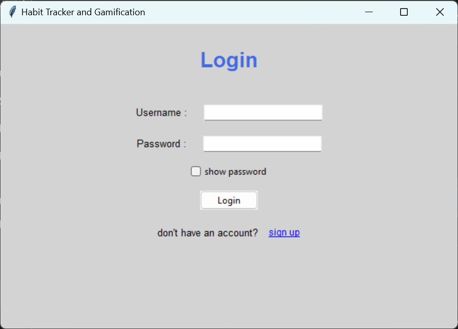  
  User login interface.

- **Enter Username**

  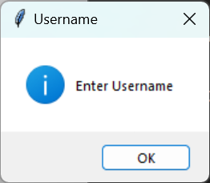

  Notification if username is not entered.

- **Enter Password**

  

  Notification if password is not entered

- **Invalid user**

    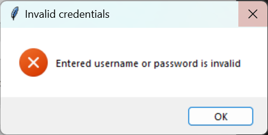
    Notification if entered username or password is invalid.

### Registration

- **Email Entry (Sign Up)**  
  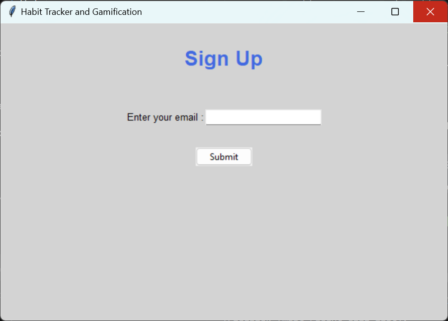  
  Screen to enter email during registration.

- **Email Notification**  
  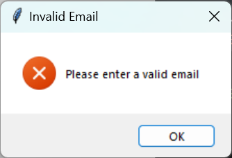  
  Alert if the email is invalid.

- **Registered Email**

  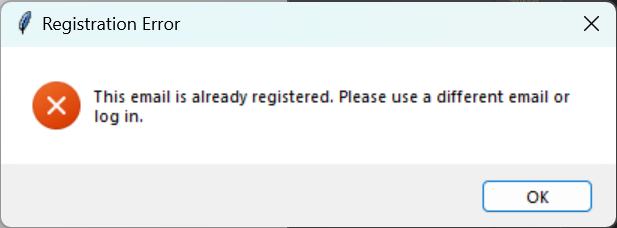
  Alert if the email is already registered.

- **Sign Up Page**  
  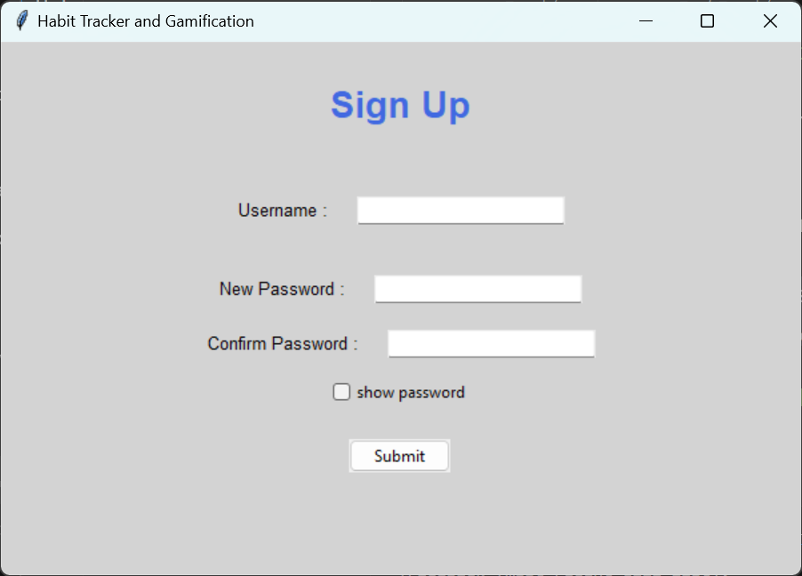  
  New user registration form.

- **Password Mismatch**

  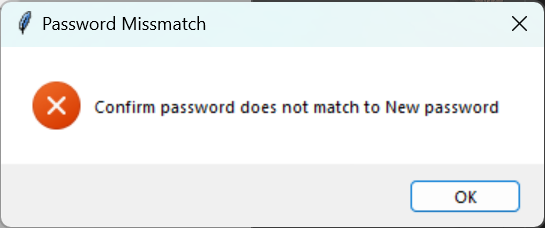
  Notification if new password doesn't match with confirm password.

- **Strong Password**

  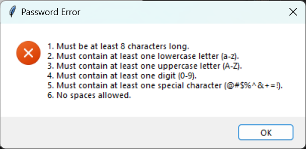
  
  Notification if entered password is not strong.

### Dashboard

- **Home Tab**  
  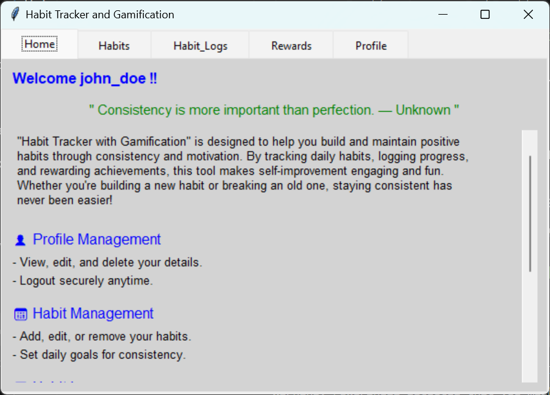  
  Dashboard showing welcome message , motivational quotes and about Habit Tracker and Gamification.

- **Habits Tab**

    - **User Habits List**  
  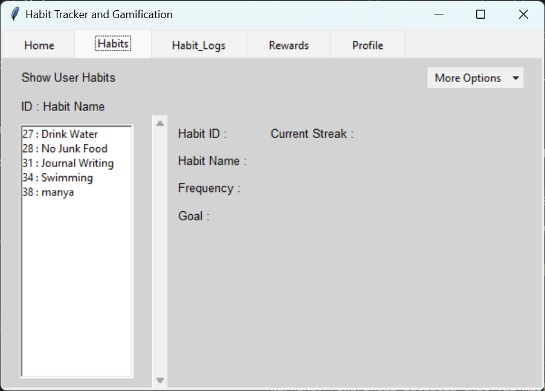  
  List of current active habits being tracked.

    - **Continue Existing Habits**  
  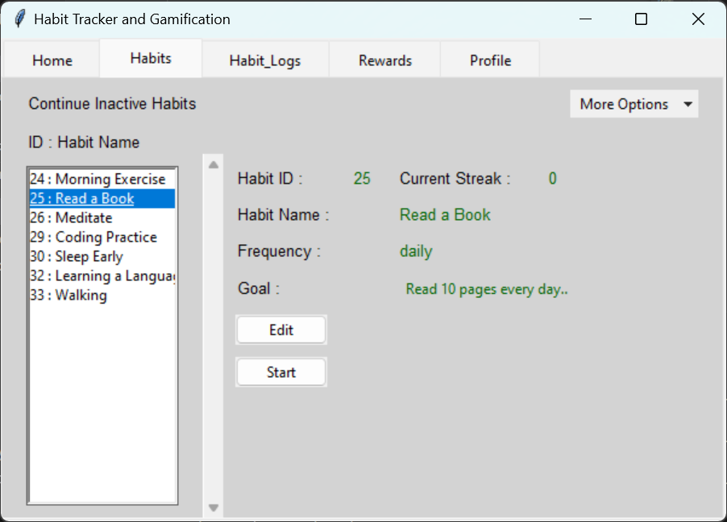  
  Option to continue with inactive habits.

  - **Add Habit**  
  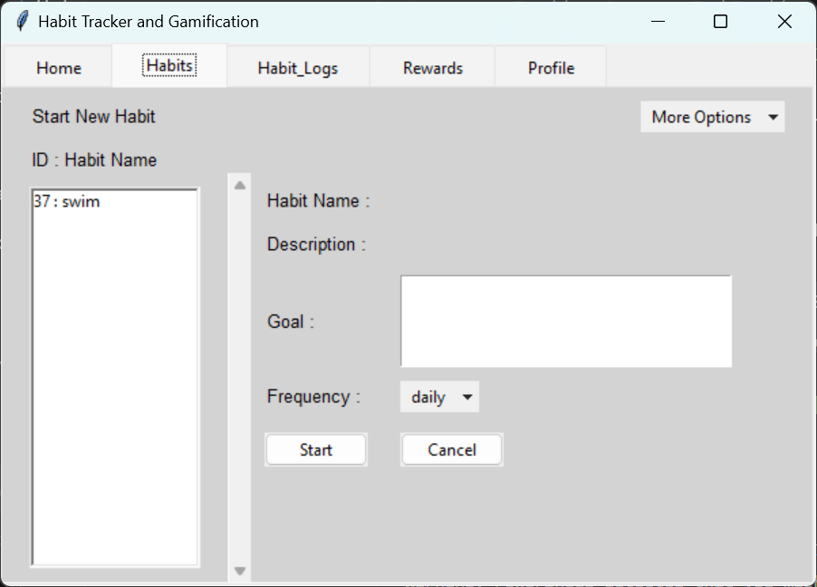  
  Option to add habit from list.

  - **Create New Habit**  
  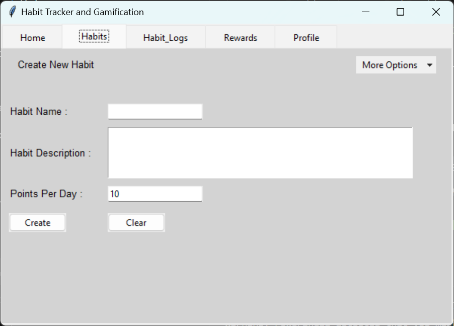  
  Interface to add a new habit.

### Habit Logs 

- **Habits Log Tab**  
  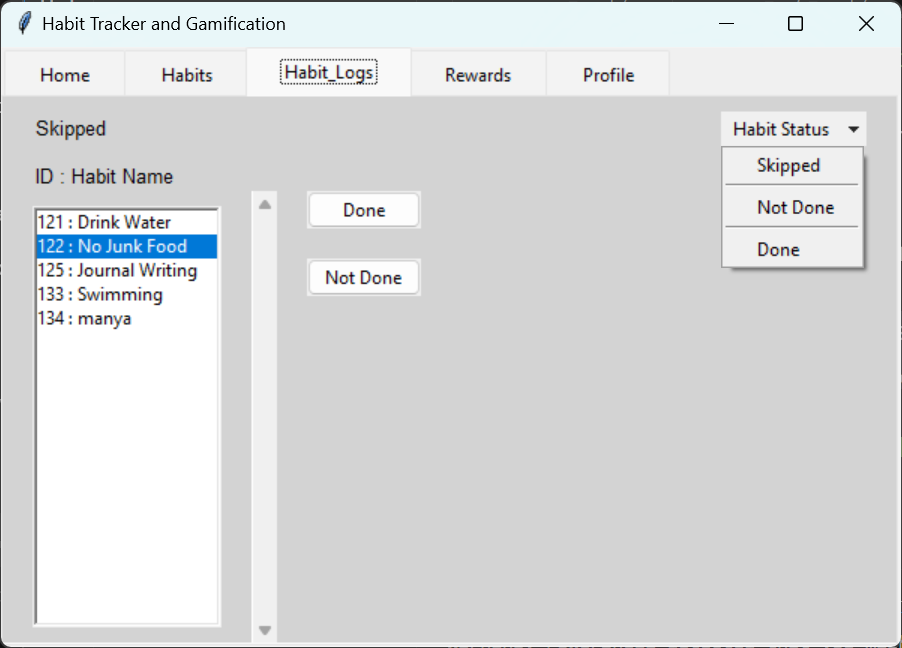  
  Daily log of habit completion status.

### Rewards

- **Rewards Tab**  
  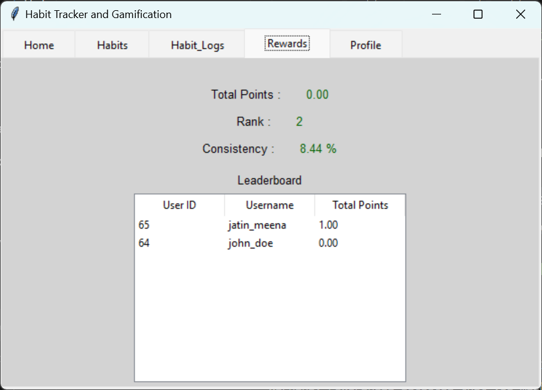  
  Gamified rewards based on user streaks. Leaderboard for top performers (max 5)

### Profile & Settings

- **Profile Tab**  
  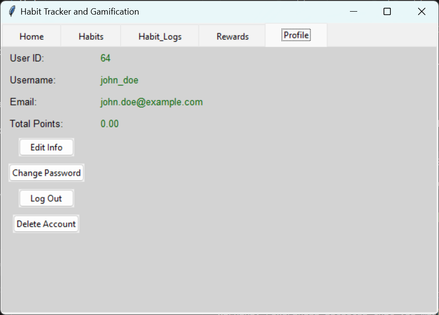  
  User profile overview with points.

- **Edit Profile Info**  
  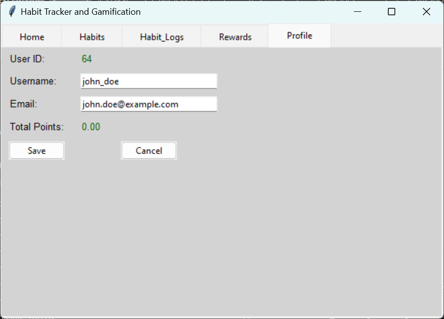  
  Screen to update user information.

- **Logout Confirmation Prompt**  
  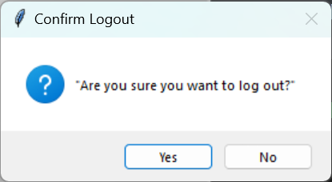  
  Notification before logging out.

- **Delete Account Confirmation**  
  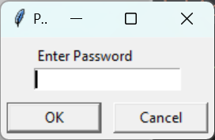  
  Password confirmation when deleting the account.

## License

This project is licensed under the MIT License.  
You are free to use, modify, and distribute this project with attribution.  
See the [LICENSE](LICENSE) file for full license details.

## Contributions

This project is currently not open for external contributions.  
For feedback, suggestions, or collaboration ideas, feel free to reach out or open an issue.
